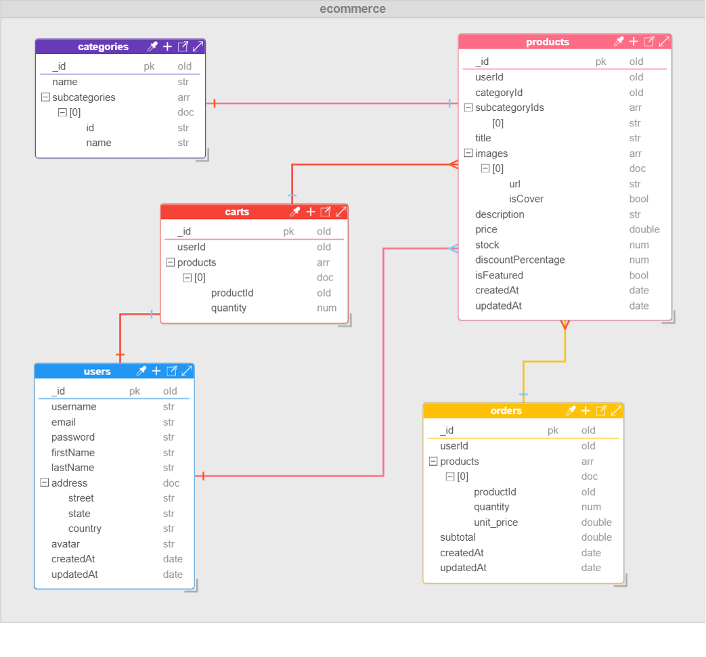

# Sistema de Ecommerce - Backend

Este repositorio corresponde al **backend** del Trabajo Práctico Obligatorio de la materia _Aplicaciones Interactivas_ (Primer Cuatrimestre 2025).

La aplicación simula un sistema de e-commerce que permite a los usuarios registrarse, iniciar sesión, navegar por un
catálogo de productos, gestionar un carrito de compras y publicar productos.

## Índice

[1. Requisitos](#1-requisitos)  
[2. Instrucciones para levantar el proyecto](#2-instrucciones-para-levantar-el-proyecto)  
  [2.1 Clonar y preparar el entorno](#21-clonar-y-preparar-el-entorno)  
  [2.2 Asignar variables de entorno](#22-asignar-variables-de-entorno)  
  [2.3 Iniciar servidor](#23-iniciar-servidor)   
[3. Funcionalidades del proyecto](#3-funcionalidades-del-proyecto)  
[4. Estructura de la Base de datos](#4-estructura-de-la-base-de-datos)  
  [4.1 Diagrama Entidad Relación](#41-diagrama-entidad-relación)  
[5. Acceso al proyecto](#5-acceso-al-proyecto)  

## 1. Requisitos

- [Java Development Kit 17](https://www.oracle.com/java/technologies/javase/jdk17-archive-downloads.html)
- [MongoDB Database Credentials](https://www.mongodb.com/es/atlas)

## 2. Instrucciones para levantar el proyecto

### 2.1 Clonar y preparar el entorno

```bash
git clone https://github.com/mquiss/APIS2025BACK
```

### 2.2 Asignar variables de entorno

Este proyecto utiliza variables de entorno para proteger credenciales sensibles. Estas se referencian en
`application.yml` como:

```yaml
spring:
  data:
    mongodb:
      uri: ${DB_URI}
  security:
    user:
      name: ${SC_USERNAME}
      password: ${SC_PASSWORD}
```

- `DB_URI`: URI de conexión a la base de datos MongoDB alojada en MongoDB Atlas. Incluye las credenciales de acceso, el
  nombre de la base de datos y parámetros de configuración necesarios para la conexión remota.
- `SC_USERNAME`: Nombre de usuario predeterminado para la autenticación básica de Spring Security.
- `SC_PASSWORD`: Contraseña correspondiente al usuario definido en SC_USERNAME, utilizada para proteger rutas HTTP
  mediante autenticación básica.

Variables de entorno que `no aparecen en application.yml`:

- `IMG_API_KEY`: Clave de acceso a la API de imgbb. Puede obtenerse en https://es.imgbb.com/.
- `IMG_EXPIRATION`: Tiempo en segundos que la imagen se mantendrá almacenada (por ejemplo: 600).
- `JWT_SECRET_KEY`: Clave secreta utilizada para firmar los tokens JWT con el algoritmo HS256. Debe tener una longitud adecuada en bits para garantizar la seguridad.
- `JWT_EXPIRATION`: Tiempo de validez del token JWT antes de que expire y deje de ser aceptado.

> ⚠️ ***Evita hardcodear valores sensibles en `application.yml`, ya que el archivo se encuentra en el repositorio remoto.***

### 2.3 Iniciar servidor

Esto levantará el backend en: [http://localhost:8080](http://localhost:8080)

## 3. Funcionalidades del proyecto

Una vez levantado el backend, se puede acceder a la documentación en: http://localhost:8080/swagger-ui/index.html

## 4. Estructura de la Base de Datos

Este proyecto utiliza una base de datos no relacional, específicamente MongoDB. La base de datos se denomina ***ecommerce*** y contiene colecciones que representan entidades clave del sistema, como usuarios, productos, categorías de productos, órdenes y carritos de compra.

### 4.1 Diagrama Entidad Relación

#### Database ``ecommerce``



## 5. Acceso al proyecto

- **Frontend React:** [Repositorio](https://github.com/jonathanmilo/APIS2025FRONT)