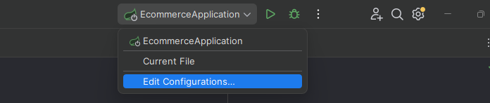
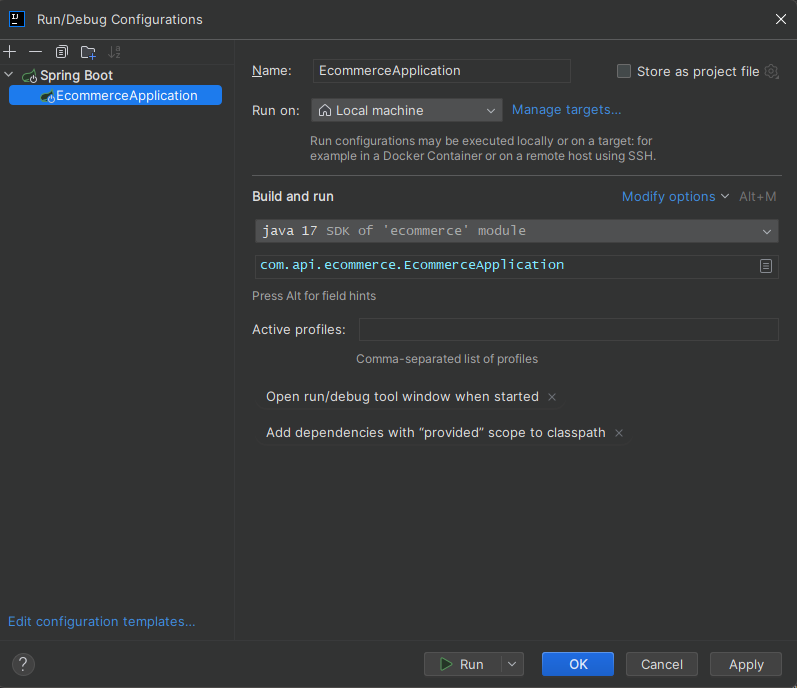
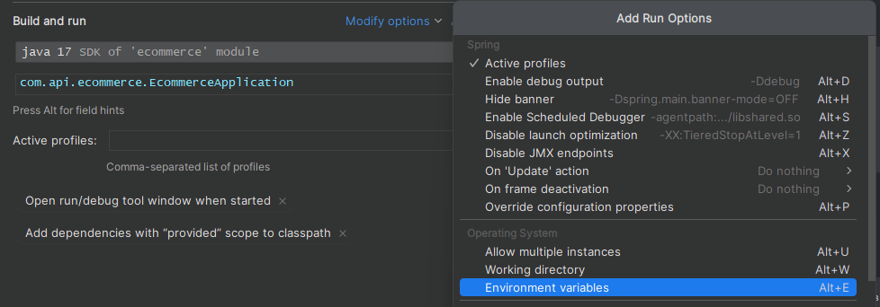
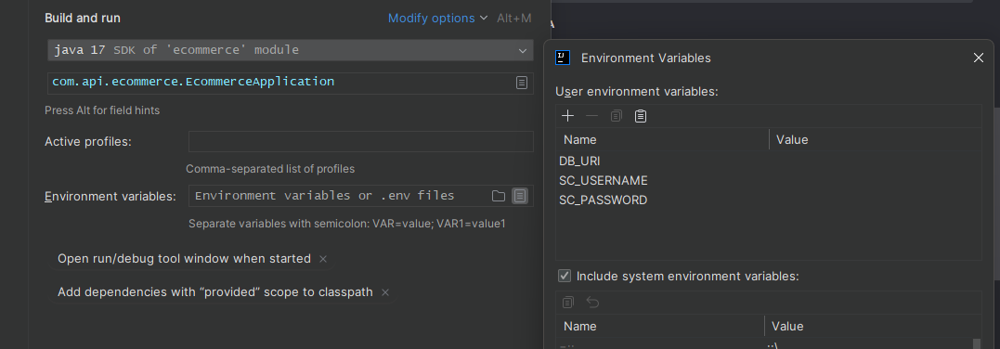
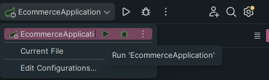
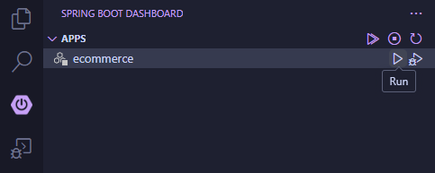
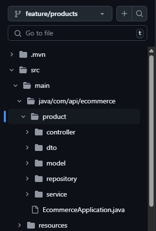

# Sistema de E-Commerce - Backend Java Spring

Este repositorio corresponde al **backend** del Trabajo Práctico Obligatorio de la materia _Aplicaciones Interactivas_ (
Primer Cuatrimestre 2025).

La aplicación simula un sistema de e-commerce que permite a los usuarios registrarse, iniciar sesión, navegar por un
catálogo de productos, gestionar un carrito de compras y publicar productos.

## Índice

[1. Requisitos](#1-requisitos)  
[2. Instrucciones para levantar el proyecto](#2-instrucciones-para-levantar-el-proyecto)  
  [2.1 Clonar y preparar el entorno](#21-clonar-y-preparar-el-entorno)  
    [Opción A: IntelliJ IDEA](#opción-a-intellij-idea)  
    [Opción B: Visual Studio Code](#opción-b-visual-studio-code)  
  [2.2 Asignar variables de entorno](#22-asignar-variables-de-entorno)  
    [Opción A: IntelliJ IDEA](#opción-a-intellij-idea-1)  
    [Opción B: Visual Studio Code](#opción-b-visual-studio-code-1)  
  [2.3 Iniciar servidor](#23-iniciar-servidor)  
    [Opción A: IntelliJ IDEA](#opción-a-intellij-idea-2)  
    [Opción B: Visual Studio Code](#opción-b-visual-studio-code-2)  
[3. Funcionalidades del proyecto](#3-funcionalidades-del-proyecto)  
  [3.1 TODO List](#31-todo-list)  
  [3.2 Subir a Github](#32-subir-a-github)  
  [3.3 Estructura de carpetas](#33-estructura-de-carpetas)  
[4. Estructura de la Base de datos](#4-estructura-de-la-base-de-datos)  
  [4.1 Diagrama Entidad Relación](#41-diagrama-entidad-relación)  
  [4.2 Collections](#42-collections)  
    [4.2.1 Collection products](#421-collection-products)  
    [4.2.2 Collection categories](#422-collection-categories)  
    [4.2.3 Collection users](#423-collection-users)  
    [4.2.4 Collection carts](#424-collection-carts)  
    [4.2.5 Collection orders](#425-collection-orders)  
[5. Acceso al proyecto](#5-acceso-al-proyecto)  

## 1. Requisitos

- [Java Development Kit 17](https://www.oracle.com/java/technologies/javase/jdk17-archive-downloads.html)
- [MongoDB Database Credentials](https://www.mongodb.com/es/atlas)

## 2. Instrucciones para levantar el proyecto

### 2.1 Clonar y preparar el entorno

```bash
git clone https://github.com/mquiss/APIS2025BACK
```

#### Opción A: IntelliJ IDEA

1. Abre IntelliJ IDEA.
2. Ve a File > Open y selecciona la carpeta APIS2025BACK.

#### Opción B: Visual Studio Code

1. Abre Visual Studio Code.
2. Instala las siguientes extensiones:
    - ***Extension Pack for Java***
    - ***Spring Boot Extension Pack***
3. Ve a File > Open y selecciona la carpeta APIS2025BACK.

### 2.2 Asignar variables de entorno

Este proyecto utiliza variables de entorno para proteger credenciales sensibles. Estas se referencian en
`application.yml` como:

```yaml
spring:
  data:
    mongodb:
      uri: ${DB_URI}
  security:
    user:
      name: ${SC_USERNAME}
      password: ${SC_PASSWORD}
```

- `DB_URI`: URI de conexión a la base de datos MongoDB alojada en MongoDB Atlas. Incluye las credenciales de acceso, el
  nombre de la base de datos y parámetros de configuración necesarios para la conexión remota.
- `SC_USERNAME`: Nombre de usuario predeterminado para la autenticación básica de Spring Security.
- `SC_PASSWORD`: Contraseña correspondiente al usuario definido en SC_USERNAME, utilizada para proteger rutas HTTP
  mediante autenticación básica.

#### Opción A: IntelliJ IDEA

1. Ve a **Run > Edit Configurations**, seleccionando la clase principal `EcommerceApplication`




2. Selecciona **Modify options** y activa las variables de entorno



3. En la sección **Environment variables**, agrega:



| Name        | Value                                             |
|-------------|---------------------------------------------------|
| DB_URI      | mongodb+srv://credentials@cluster.mongodb.net/... |
| SC_USERNAME | username                                          |
| SC_PASSWORD | password                                          |

#### Opción B: Visual Studio Code

1. Abre una terminal (PowerShell) y ejecuta:

```bash
$env:DB_URI="mongodb+srv://credentials@cluster.mongodb.net/..."
$env:SC_USERNAME="username"
$env:SC_PASSWORD="password"
```

Esto ***solo funcionará mientras la terminal se encuentre abierta***. Al no ser permanente, se deberá repetir el proceso antes
de empezar a trabajar en el proyecto.

> ⚠️ ***Evita hardcodear valores sensibles en `application.yml`, ya que el archivo se encuentra en el repositorio remoto.***

### 2.3 Iniciar servidor

#### Opción A: IntelliJ IDEA

1. Haz clic en el botón verde sobre la clase `EcommerceApplication`:



#### Opción B: Visual Studio Code

1. Abre **Spring Boot Dashboard** y ejecuta la aplicación:



> Esto levantará el backend en: [http://localhost:8080](http://localhost:8080)

## 3. Funcionalidades del proyecto

### 3.1 TODO List

- [ ] Products
- [ ] Carts
- [ ] Users
- [ ] Categories
- [ ] Orders
- [ ] Auth

### 3.2 Subir a Github

Cada funcionalidad se trabajará en su respectiva rama `feature\nombre`

```bash
git branch feature\products
git checkout feature\products
```

### 3.3 Estructura de carpetas



## 4. Estructura de la Base de Datos

Este proyecto utiliza una base de datos no relacional, específicamente MongoDB. La base de datos se denomina ***ecommerce*** y contiene colecciones que representan entidades clave del sistema, como usuarios, productos, categorías de productos, órdenes y carritos de compra.

### 4.1 Diagrama Entidad Relación

#### Database ``ecommerce``


### 4.2 Collections

#### 4.2.1 Collection ``products``

Registros: [products.json](/docs/data/products.json)

#### 4.2.2 Collection ``categories``

Registros: [categories.json](/docs/data/categories.json)

#### 4.2.3 Collection ``users``

Registros: [users.json](/docs/data/users.json)

#### 4.2.4 Collection ``carts``

Registros: [carts.json](/docs/data/carts.json)

#### 4.2.5 Collection ``orders``

Registros: [orders.json](/docs/data/orders.json)

## 5. Acceso al proyecto

- **Login (Spring Security):** [http://localhost:8080/login](http://localhost:8080/login)

> Ingresar los valores de las variables de entorno **SC_USERNAME** y **SC_PASSWORD** en el formulario para poder acceder
> a todas las rutas del proyecto.
